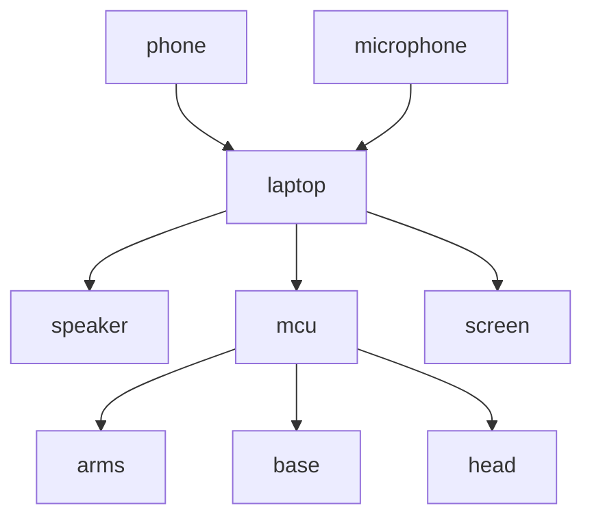

# RCJ2024
This year, we went full AI

We have one humanoid robot with two arms and a base to drive on.
On the chest of the robot, we have an IPS LCD panel salvaged from an old laptop.
The head of the robot is a [Bose Soundlink Mini]() as its mouth (for speech) and a phone for the eyes and face tracking.

## Robot Overview

The phone ([Samsung Galaxy A21s]()) runs a custom [Android App]() that renders the eyes and runs the [YOLO model]() for face tracking, and it sends the face position to the laptop with a USB cable.

The laptop ([HP Victus something something]()) runs the [OpenAI Whisper model]() for speech recognition and then generates a response with the [Zephyr 7B Beta model](), which then runs through a filter that triggers the hand animations and also send the image prompts to the stable diffusion server.

When the [stable diffusion server](src/sd-server) receives a prompt, it immediately starts generating the image and when it's done it renders it on the screen using parts of my game engine called [Artifex](https://github.com/samthedev32/Artifex)

After the filtering is completed, the "remaining" text gets sent to a [piper model]() which converts it to audio and it gets played on the bluetooth speaker using [OpenAL]().

The arms are powered by 4 [xyz servos]() each, and the base is driven by 2 [xyz stepper motors](), which are powered by a 12 volt lead-acid battery. This system is controlled by a [Raspberry Pi Pico]() that receives the instructions from the laptop with a USB cable.

It gets sent the poses to take, or pose-animations to play which are then written to the servos, and alsogets if it should turn right or left, which it does.

## Story // Lore
An interview with an AI Painter

## Libraries

- TTS: [rhasspy/piper](https://github.com/rhasspy/piper)
- STT: [ggerganov/whisper.cpp](https://github.com/ggerganov/whisper.cpp)
- LLM: [ggerganov/llama.cpp](https://github.com/ggerganov/llama.cpp)
- Image Gen: [leejet/stable-diffusion.cpp](https://github.com/leejet/stable-diffusion.cpp)

## Models

- TTS: [rhasspy/piper-voices](https://huggingface.co/rhasspy/piper-voices) (hu: *imre*, en: *kusal*)
- STT: [TODO](TODO)
- LLM: [HuggingFaceH4/zephyr-7b-alpha](https://huggingface.co/HuggingFaceH4/zephyr-7b-alpha)
- Image Gen: [TODO](TODO)

## Programs

### [llm-chat](src/llm-chat)

This is the code that runs the Speech-aspect of the robot. It runs the whisper, llm and piper models while connecting every part of the robot.

### [sd-server](src/sd-server)

This code generates the image and renders it to the screen. There's nothing else to it.

### [mcu](src/mcu)

This is the code that runs on the MCU, controlling every motor.

### [tracker](src/tracker)

This is an Android App that runs the face tracking and also renders the eyes

### [pose-sim](src/pose-sim)

This is a pose simulation to be able to quickly animate the robot's arms (without breaking them)