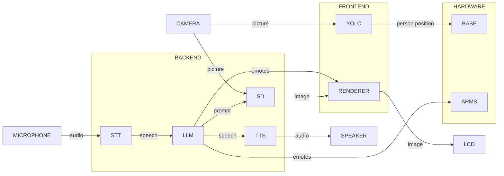

# RCJ2024
This year, we went full AI

We have one humanoid robot with two arms and a base to drive on.
On the chest of the robot, we have an IPS LCD panel salvaged from an old laptop.
The head of the robot is a laptop that renders a face while displaying the generated images on the chest
All of the heavy-lifting is done onboard another laptop that "controls" the robot

## Story
An interview with an AI Painter
TODO

## Communication Diagram
